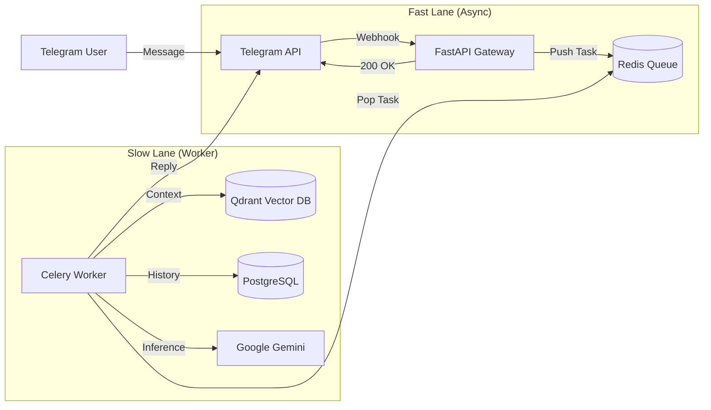

# 🤖 Telegram RAG Bot
A high-performance, asynchronous Telegram chatbot that "talks" to your documents. Built with a distributed worker architecture to handle high concurrency, it features Context Awareness (Memory), Computer Vision (PDF/Image reading), and Hallucination Control.
# 🏗 Architecture
The system follows an asynchronous Producer-Consumer pattern to ensure the bot never "hangs," even under heavy load.


## Key Features
* 🧠 RAG Engine: Retrieves accurate answers from your uploaded PDFs, TXT, and MD files.
* 👁️ Computer Vision: Upload a PDF or Image, and the bot reads it using OCR/Extraction.
* 💬 Context Aware: Remembers the last 5-10 turns of conversation to handle follow-up questions.
* ⚡ Async & Scalable: Uses Celery + Redis to handle heavy AI tasks in the background.
* 🛡️ Hallucination Control: If the answer isn't in the docs, it explicitly says "I don't have enough information in my documents to answer that".

# 🚀 Getting Started
## Prerequisites
* Docker & Docker Compose
* A Telegram Bot Token (from @BotFather)
* A Google Gemini API Key (from Google AI Studio)
1. Clone the Repository
git clone [https://github.com/your-username/telegram-rag-bot.git](https://github.com/your-username/telegram-rag-bot.git)
cd telegram-rag-bot

2. Configure Environment
Create a `.env` file in the root directory:
    ```plaintext
    # --- Telegram ---
    BOT_TOKEN=123456:ABC-DEF1234ghIkl-zyx57W2v1u123ew11
    TELEGRAM_SECRET_TOKEN=my-super-secret-token
    
    # --- Google Gemini ---
    GOOGLE_API_KEY=AIzaSy...
    
    # --- Database ---
    DB_USER=postgres
    DB_PASSWORD=securepassword
    DB_NAME=rag_db
    # Async for FastAPI
    DATABASE_URL_ASYNC=postgresql+asyncpg://postgres:securepassword@db:5432/rag_db
    # Sync for Celery
    DATABASE_URL_SYNC=postgresql+psycopg2://postgres:securepassword@db:5432/rag_db
    
    # --- Infrastructure ---
    CELERY_BROKER_URL=redis://redis:6379/0
    CELERY_RESULT_BACKEND=redis://redis:6379/0
    QDRANT_URL=http://qdrant:6333
    ```

3. Run with Docker
`docker-compose up --build -d
`
4. Set the Webhook
You need to tell Telegram where your bot is living.
Localhost: Use ngrok (ngrok http 8000).
Production: Use your domain URL.
`curl -F "url=[https://your-domain.com/webhook](https://your-domain.com/webhook)" \
     -F "secret_token=my-super-secret-token" \
     [https://api.telegram.org/bot](https://api.telegram.org/bot)<YOUR_BOT_TOKEN>/setWebhook
`
# 🎮 Usage Guide

### 1. Talking to the Bot
Just send a message!   
&nbsp;&nbsp;&nbsp;&nbsp;**User:** "Who are you?"   
&nbsp;&nbsp;&nbsp;&nbsp;**Bot:** "I am an AI assistant..."

### 2. Teaching the Bot (Ingestion)
Simply **drag and drop** a file into the Telegram chat.

* **Supported Formats:** `.pdf`, `.txt`, `.md`, `.py`, `.json`, `.csv`
* **Action:** The bot will download, chunk, embed, and index the file into Qdrant.

### 3. Commands
|  Command  | Description |
|-----------| --- |
| `/start`  | Welcome message and instructions. |
| `/help`   | List available commands. |
| `/newchat` | **Clear Context:** Wipes short-term memory (conversation history). |
| `/reset`  | **Factory Reset:** Wipes long-term memory (deletes all uploaded files/vectors). |

# 🛠️ Development & Debugging
### Inspecting Databases
The `docker-compose.yml` exposes ports for local inspection:
* Postgres: `localhost:5432` (User: `user`, Pass: `password`)
* Qdrant: `http://localhost:6333/dashboard`
* Redis: `localhost:6379`
### Viewing Logs
To trace a specific request from Webhook -> Worker -> AI:  
```
docker-compose logs -f
```
Look for the `trace_id` in the logs to follow a single request across services.
# 📂 Project Structure
```
/rag-bot
├── app/
│   ├── main.py              # FastAPI Webhook (Entry Point)
│   ├── worker.py            # Celery Worker (The Brain)
│   ├── rag_engine.py        # Logic for Prompt Engineering & Gemini
│   ├── models.py            # SQLModel Database Schemas
│   ├── database.py          # DB Connection Logic
│   ├── ingest.py            # Document chuking and embedding
|   └── logger_setup.py      # Logging config
├── docker-compose.yml       # Orchestration
├── .env                     # Environment variables
├── requirements.txt         # Python Dependencies
└── README.md                # Documentation
```
