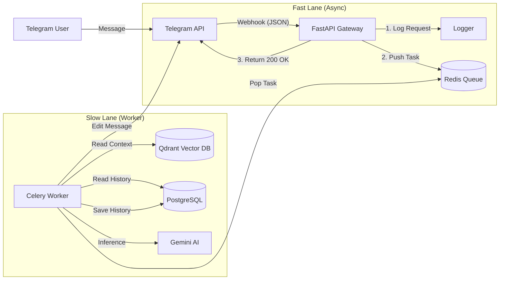

# System Architecture

## 1. High-Level Design
The system follows an **Asynchronous Worker Architecture**. The frontend (Telegram Webhook) is decoupled from the heavy logic (AI Inference) via a Message Queue. This ensures high availability and responsiveness.

### Diagram


---

## 2. Component Breakdown
### 2.1. The Gateway (FastAPI)

* Role: The "Receptionist". It accepts messages, validates them, and hands them off.
    
* Responsibility:
    
  * Validate Telegram Secret Token.
    
  * Generate a unique Trace ID for the request.
    
  * Push the job to Redis.
    
  * Return 200 OK immediately (Target: <100ms).
    
* Tech: Python 3.11, FastAPI, Uvicorn, Aiogram Types.

### 2.2. The Broker (Redis)

* Role: The "Mailbox".

* Responsibility:

  * Act as the Message Broker for Celery.

  * (Optional) Act as a Result Backend if we need to check task status later.

* Tech: Redis 7-Alpine.

### 2.3. The Brain (Celery Worker)

* Role: The "Thinker". It performs the heavy lifting.

* Responsibility:

  * Retrieval: Fetch semantic context from Qdrant.

  * Memory: Fetch conversation history from Postgres.

  * Generation: Call Google Gemini 1.5 Flash.

  * Response: Send the final text back to the user via Telegram API.

* Tech: Celery 5.x, LangChain, Sync Database Driver (psycopg2 via SQLModel).

### 2.4. Storage Layer

* PostgreSQL (Long-Term Memory):

  * Stores Users, Conversations, and Messages.

  * Uses pgvector extension (optional future-proofing).

* Qdrant (Knowledge Base):

  * Stores document embeddings (Vectors).

  * Stores metadata (Page numbers, Source filenames).

---

## 3. Data Flow (The Life of a Request)

1. Ingress: User sends "How does the pricing work?"

2. Routing: Telegram hits POST /webhook.

3. Queueing: FastAPI generates Trace ID abc-123, enqueues task process_rag_message(chat_id=99, text="..."), and replies 200 OK.

4. Processing:

   * Worker pops task abc-123.

   * Worker sends "Typing..." action to chat 99.

   * Worker queries Qdrant for "pricing".

   * Worker queries Postgres for last 5 messages.

   * Worker sends prompt to Gemini.

5. Egress: Gemini responds. Worker saves interaction to Postgres. Worker calls Telegram sendMessage API.

---

## 4. Directory Structure
```
/rag-bot
├── docs/                    # Architecture & Requirements
├── app/
│   ├── __init__.py
│   ├── main.py              # FastAPI Webhook Entry
│   ├── worker.py            # Celery Task Definitions
│   ├── rag_engine.py        # LangChain & Qdrant Logic
│   ├── models.py            # SQLModel Database Schemas
│   ├── database.py          # Database Connection Logic
│   ├── logger_setup.py      # Structlog Configuration
│   └── ingest.py            # Script to load PDFs
├── .env                     # Secrets (GitIgnored)
├── docker-compose.yml       # Infrastructure Orchestration
├── requirements.txt         # Dependency Lockfile
└── init.sql                 # Database Initialization
```

---