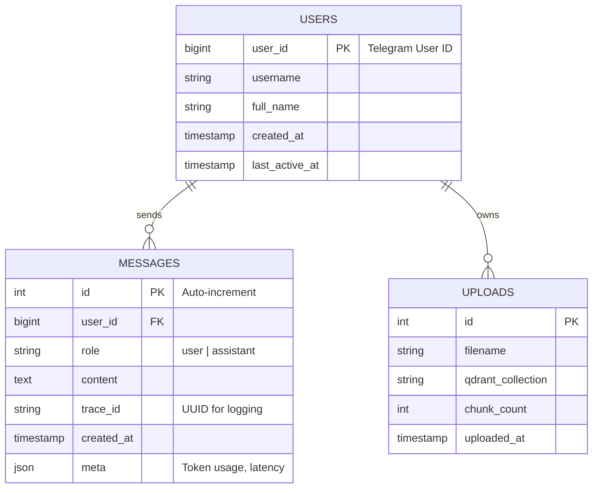

# Database Schema & ERD

## 1. Entity Relationship Diagram (ERD)



---

## 2. SQLModel Schema (PostgreSQL)

These are the actual Python classes you will put in `app/models.py`.
### 2.1. The User

```python

from typing import Optional, List
from datetime import datetime
from sqlmodel import SQLModel, Field, Relationship

class User(SQLModel, table=True):
    __tablename__ = "users"
    
    # Telegram IDs can be larger than standard Integer, so we use BigInt logic
    user_id: int = Field(primary_key=True, index=True, sa_column_kwargs={"bigint": True}) 
    username: Optional[str] = None
    full_name: Optional[str] = None
    created_at: datetime = Field(default_factory=datetime.utcnow)
    last_active_at: datetime = Field(default_factory=datetime.utcnow)

    # Relationships
    messages: List["Message"] = Relationship(back_populates="user")
```

### 2.2. The Message
```Python

from sqlalchemy import Column, JSON

class Message(SQLModel, table=True):
    __tablename__ = "messages"

    id: Optional[int] = Field(default=None, primary_key=True)
    user_id: int = Field(foreign_key="users.user_id", index=True)
    
    role: str = Field(description="user or assistant")
    content: str = Field(description="The text content")
    
    # Observability
    trace_id: Optional[str] = Field(default=None, index=True)
    
    # Metadata (Token usage, latency, etc.)
    meta: Optional[dict] = Field(default={}, sa_column=Column(JSON))
    
    created_at: datetime = Field(default_factory=datetime.utcnow)

    # Relationships
    user: Optional[User] = Relationship(back_populates="messages")
```
### 2.3. The Upload (Audit Log)

We do not store the PDF content here. We only track that we uploaded it.
```Python

class Upload(SQLModel, table=True):
    __tablename__ = "uploads"

    id: Optional[int] = Field(default=None, primary_key=True)
    filename: str
    qdrant_collection: str
    chunk_count: int
    uploaded_at: datetime = Field(default_factory=datetime.utcnow)
```

---

## 3. Vector Database Schema (Qdrant)

Qdrant is NoSQL, so it uses JSON payloads. Here is the structure we enforce.
### 3.1. Collection Name

* **Name**: `knowledge_base`
* **Distance Metric**: `Cosine`
* **Vector Size**: `768` (Standard for Google Gemini Embeddings `embedding-001`).

### 3.2. Payload Structure (The "Metadata" in each Vector)

Every chunk stored in Qdrant will look like this:
```JSON

{
  "id": "uuid-of-chunk",
  "vector": [0.01, -0.23, ...],
  "payload": {
    "source": "manual_v1.pdf",
    "page": 12,
    "chunk_index": 45,
    "text": "The warranty period is 2 years..."
  }
}
```

---

## 4. Indexing Strategy

* Postgres:

  * Index on `messages.user_id` (Speed up "Get Chat History").

  * Index on `messages.created_at` (Speed up sorting).

  * Index on `messages.trace_id` (Speed up debugging).

* Qdrant:

  * Filterable Index on `source` (Allows us to query only specific PDFs if needed later).

---